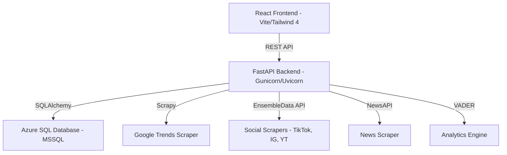

# Trends Research

A professional, full-stack intelligence platform for discovering, tracking, and analyzing emerging trends across multiple data sources. The system scrapes data from Google Trends, YouTube, Reddit, Hacker News, TikTok, Instagram, Threads, and NewsAPI, then processes it through an advanced analytics engine that calculates virality scores, clusters topics into niches, and surfaces actionable insights through a modern React dashboard.

---

## 🏗️ Architecture



### Key Components

| Component | Location | Description |
|-----------|----------|-------------|
| **React Frontend** | `frontend/` | Built with **React 19**, **Vite**, **Tailwind CSS 4**, and **shadcn/ui**. |
| **FastAPI Backend** | `src/api/` | REST API with 30+ endpoints, serving as the orchestration layer. |
| **Scrapers** | `src/scrapers/` | Custom Scrapy spiders + EnsembleData & NewsAPI clients. |
| **Analytics Engine** | `src/analytics/` | Custom virality scoring and VADER-based sentiment analysis. |
| **Niche Discovery** | `src/niche/` | Topic clustering using Union-Find algorithm and keyword overlap. |
| **Database** | `src/db/` | SQLAlchemy models with robust migration and diagnostic tools. |
| **Infrastructure** | `terraform/` | Fully automated Azure deployment (App Service, SQL, Key Vault). |

---

## 🚀 Quick Start

### Prerequisites

- **Python 3.11+**
- **Node.js 22+** with `pnpm`
- **ODBC Driver 18** for SQL Server
- **Azure Subscription** (optional, for cloud deployment)

### 1. Clone and Configure

```bash
git clone https://github.com/GlobalBrother/trends_research.git
cd trends_research
cp .env.example .env
# Edit .env with your database credentials and API keys
```

### 2. Install Python Dependencies

```bash
pip install -r requirements.txt
```

### 3. Install and Build the Frontend

```bash
cd frontend
pnpm install
pnpm build
cd ..
```

### 4. Database Setup & Migration

The project uses an idempotent migration system that handles both schema creation and indexing:

```bash
# Initial setup and schema creation
python -m src.db.setup_azure

# Run migration to sync indexes and new columns
python -m src.db.migrate
```

### 5. Start the Application

#### Development Mode (Hot Reload)
- **Terminal 1 (API):** `python src/api/main.py`
- **Terminal 2 (Frontend):** `cd frontend && pnpm dev`

#### Production Mode
The API is configured to serve the built frontend SPA automatically:
```bash
gunicorn src.api.main:app -k uvicorn.workers.UvicornWorker --bind 0.0.0.0:8000
```

---

## 🔐 Authentication & Security

- **OTP-based Login:** Uses Azure Communication Services (ACS) or Resend to send One-Time Passwords.
- **Role-Based Access Control (RBAC):** Two roles: `trends` (viewer) and `admin` (management/settings).
- **JWT-less Session Management:** Secure tokens stored in the database with configurable expiration.
- **Azure Key Vault:** Seamless integration for managing secrets in production environments.

---

## 📊 Analytics Engine

The system uses an advanced, multi-factor virality scoring algorithm:
$$Virality = \text{Freshness} \times (1 + 99 \times \text{sigmoid}(\text{LogVolume} + 2 \times \text{Growth} + \text{Engagement} + (\text{Diversity} + \text{Synergy}) + \text{Platform} + \text{Momentum} + \text{Surprise} + \text{Sentiment} + \text{Spread}))$$

### Core Scoring Factors

- **⏳ Freshness (Time Decay):** Exponential decay factor ($0.5^{age/24}$) that penalizes older trends, ensuring the dashboard surfaces what's breaking *now*.
- **🤝 Cross-Platform Synergy:** A multiplier bonus for trends that resonate across different platform types (e.g., a trend appearing on both TikTok and HackerNews).
- **📈 Momentum (Acceleration):** Measures the rate of change in growth. A trend with increasing speed is prioritized over one with steady high volume.
- **😲 Surprise Factor (Z-Score):** Highlights statistical outliers by comparing current volume to the historical/batch mean, surfacing "under-the-radar" breakouts.
- **🤖 Sentiment Analysis:** Integrated VADER sentiment scoring. Strong sentiment (positive or negative) boosts the virality score.
- **🌐 Geographic Spread:** Bonus points for trends surfacing in multiple regions.
- **🧩 Topic Clustering:** Union-Find algorithm groups similar topics across different platforms into a single "Aggregated Topic" to reduce noise and calculate true cross-platform impact.

---

## ☁️ Infrastructure & Deployment

### Terraform (Azure)
The `terraform/` directory contains everything needed to provision the stack on Azure:
- **Azure SQL:** Serverless database with auto-pause.
- **Azure Container Registry (ACR):** Private registry for Docker images.
- **App Service (Linux):** Web App for Containers hosting the API + Frontend.
- **Key Vault:** Centralized secret management.
- **Managed Identity:** Passwordless authentication between services.

### Docker
```bash
# Build and run with Docker Compose
docker compose up --build
```

---

## Product Development Plan

The next stage of this platform is not just collecting more trends. The goal is
to turn detected trends into reliable ad intelligence that media buyers,
strategists, and creative teams can use to create better ads with higher
confidence.

### 1. Product Goal

Build a trend intelligence platform that answers four questions for ad teams:

1. What is rising now?
2. Why is it rising?
3. Is it commercially relevant for paid media?
4. What should we do with it in creative, targeting, timing, and platform mix?

This means the platform must evolve from a trend dashboard into a
decision-support system for ad planning.

### 2. Current Foundation

The repository already contains the main building blocks:

- Multi-source ingestion across Google Trends, YouTube, Reddit, Hacker News,
  TikTok, Instagram, Threads, NewsAPI, and GetHookdAI ad data.
- A backend analytics pipeline for sentiment, clustering, and virality scoring.
- An ads ingestion path and tracked-brand workflow for ad library research.
- A frontend trend explorer, ads workspace, and report surfaces that can be
  extended into a real insight workflow.

The main gap is not scraping. The main gap is transforming raw trend signals
into structured, explainable, and measurable ad recommendations.

### 3. Strategic Priorities

#### A. Stabilize the platform as a research system

Before adding more intelligence, the data pipeline must be dependable.

Key work:

- Formalize canonical schemas for `trend`, `content`, `ad`, `brand`, and
  `insight`.
- Add data quality checks for duplicates, missing geo, missing timestamps,
  stale platform data, and scrape error rates.
- Add platform freshness and source confidence scoring.
- Track scrape latency, API credit usage, stale data windows, and failure
  patterns.
- Finish production deployment hardening so releases are routine.

Reason:

- If the inputs are noisy, the insight layer will produce confident but weak
  output.

#### B. Build a real trend-to-insight engine

The platform needs a first-class insight layer, not just charts and tables.

For each aggregated trend cluster, generate structured fields such as:

- `trend_strength`
- `confidence_score`
- `audience_intent`
- `creative_angle_candidates`
- `platform_fit`
- `ad_timing_window`
- `saturation_risk`
- `brand_safety_risk`
- `monetization_potential`

Each insight should also include explanations:

- Why the trend is rising
- Which platforms support it
- What type of audience response is visible
- Why it is relevant for ads
- Why the system is confident or uncertain

Rule:

- Insights should be grounded in platform signals first. LLM output can explain
  them later, but should not be the primary source of truth.

#### C. Link trends to ad evidence

The most important product step is connecting emerging trends to real ads
already running in the market.

Key work:

- Match trend clusters to ads from the `ads_insight` dataset.
- Use keyword overlap, semantic similarity, timing overlap, and category or
  brand proximity to create trend-to-ad relationships.
- Surface, for each trend:
  - which brands are already advertising into it
  - which formats are dominant
  - which CTAs are common
  - which ads look high-performing
  - whether the opportunity is early, crowded, or declining

This is the bridge from "interesting trend" to "usable ad opportunity."

#### D. Build an Ad Opportunity Engine

The platform should not stop at showing data. It should rank opportunities.

Recommended scoring direction:

`ad_opportunity_score = trend_strength + commercial_relevance + audience_signal + creative_reusability - saturation - safety_risk`

For each ranked opportunity, output:

- Opportunity title
- Audience summary
- Recommended platform(s)
- Recommended creative hook(s)
- Suggested CTA direction
- Best timing window
- Example competitor ads
- Risk notes

Recommended opportunity classes:

- Emerging opportunity
- Fast-follower opportunity
- Overcrowded trend
- Unsafe or volatile trend
- Evergreen topic with renewed momentum

#### E. Rework the frontend around workflows

The UI should support how ad teams actually work, not just how data is stored.

Key work:

- Extend Trend Explorer with:
  - insight summaries
  - "why this matters for ads"
  - creative directions
  - linked competitor ads
  - risk and confidence indicators
- Extend My Ads with:
  - competitor comparison
  - missed-trend alerts
  - CTA benchmarking
  - format benchmarking
  - brand-to-trend fit analysis
- Replace placeholder reports with real generated briefing outputs:
  - weekly opportunity digests
  - trend deep dives
  - campaign planning briefs
  - competitor creative summaries

#### F. Add LLMs only after structured insights exist

LLMs should summarize, explain, and package insights. They should not invent
the core signal.

Best uses:

- Executive summaries
- Natural-language insight narratives
- Ad angle suggestions
- Report generation
- Persona and messaging hypotheses

Constraint:

- Confidence and ranking must come from deterministic signals, not from LLM
  language quality.

### 4. Data Model Additions

To support a real insight layer, add these entities:

#### `trend_clusters`

- canonical cluster id
- cluster title
- cluster keywords
- first seen
- last seen
- confidence
- lifecycle stage

#### `trend_signals`

- cluster id
- platform
- volume
- growth
- engagement
- sentiment
- freshness
- geo spread

#### `trend_insights`

- cluster id
- ad opportunity score
- audience summary
- creative angles
- platform recommendations
- risks
- explanation JSON

#### `trend_ad_matches`

- cluster id
- ad id
- match score
- match reason
- matched at

#### `insight_feedback`

- user rating
- marked useful or not useful
- used in campaign or not
- actual outcome if available

This feedback loop is required if the system is expected to improve its
accuracy over time.

### 5. Accuracy Framework

If the platform is intended to guide ad creation, "accuracy" must be defined
explicitly.

Recommended dimensions:

- Trend detection accuracy
- Commercial relevance accuracy
- Timing accuracy
- Brand safety accuracy
- Creative recommendation usefulness

Recommended evaluation process:

1. Build a labeled historical dataset of trend clusters.
2. Mark which clusters became commercially relevant.
3. Mark which platforms were best suited to each cluster.
4. Mark which trends became saturated too quickly.
5. Backtest the ranking and recommendation engine weekly.
6. Track false positives and false negatives.
7. Collect direct feedback from strategists and campaign teams.

Without this, the system can be informative but not dependable.

### 6. Recommended Execution Sequence

#### Phase 1: Foundation and confidence

- Formalize schemas and quality checks.
- Add confidence, freshness, and source trust metrics.
- Improve monitoring, diagnostics, and scheduled ingestion reliability.

#### Phase 2: Cluster-level intelligence

- Introduce cluster-level storage and APIs.
- Store structured trend signals and cluster metadata.
- Move from row-level trend output toward canonical trend entities.

#### Phase 3: Trend-to-ad linkage

- Match trend clusters against ad library data.
- Add competitor ad evidence to trend views.
- Expose saturation, CTA, and format patterns.

#### Phase 4: Opportunity ranking

- Implement the first `ad_opportunity_score`.
- Add explainable recommendations and risk notes.
- Rank opportunities by utility for ad teams rather than by virality alone.

#### Phase 5: Reporting and workflow UX

- Replace placeholder report views with real generated reports.
- Add weekly briefs, opportunity digests, and campaign planning summaries.
- Add saved views and collaboration after the core workflow is stable.

#### Phase 6: LLM synthesis and optimization

- Add LLM-based summarization on top of structured insights.
- Add prompt logging and output auditing.
- Tune scoring using feedback and historical performance data.

### 7. Immediate Next Steps for This Repository

The most practical near-term implementation order is:

1. Refactor the backend around cluster-level insight objects.
2. Add a trend-to-ad matching layer on top of `ads_insight`.
3. Create a new API surface for structured insights and opportunity scoring.
4. Replace the placeholder Reports page with real generated opportunity briefs.
5. Add feedback capture and backtesting before expanding aggressively into new
   sources.

### 8. Working Principle

The platform should always prefer:

- explainable signals over opaque scoring
- measured usefulness over impressive-looking summaries
- commercial relevance over raw virality
- feedback-driven improvement over intuition-only roadmap decisions

---

## 🛠️ Maintenance & Diagnostics

Check your database connectivity and Azure configuration:
```bash
python -m src.db.doctor
```

Additional implementation docs:

- `docs/canonical-schemas.md`
- `docs/insights-api.md`
- `docs/release-checklist.md`

---

## 📋 Daily Meeting Notes

### 2026-04-08 — Sprint Session

**Participants:** Development Team

#### 1. Deployment Pipeline Fix (Docker)
- **Problem:** `deploy.sh` failed with `DOCKER_COMMAND_ERROR` — Docker daemon not available in WSL environment.
- **Solution:** Added runtime check (`docker info`); when Docker is unavailable, the script falls back to `az acr build` (ACR Tasks) which builds and pushes the image server-side without needing a local Docker daemon. Original local build/push flow preserved when Docker is available.
- **Files changed:** `deploy.sh`

#### 2. Azure Resource Auto-Provisioning
- **Problem:** `az webapp restart` failed with `ResourceNotFound` — the App Service `trends-research-app` did not exist in the resource group.
- **Solution:** Replaced bare restart with existence checks for Resource Group, App Service Plan, and Web App. If the Web App doesn't exist, the script now creates it automatically with `az webapp create`, configures `WEBSITES_PORT`, and sets storage settings. If it already exists, it updates the container image and restarts.
- **New configurable env vars:** `APP_SERVICE_PLAN`, `APP_SERVICE_SKU`, `LOCATION` (with sensible defaults).
- **Files changed:** `deploy.sh`

#### 3. Resource Group Configuration
- **Change:** Updated default `RESOURCE_GROUP` from `trends-research-rg` to `GB_Reporting_RG` to match the existing Azure infrastructure.
- **Files changed:** `deploy.sh`

#### 4. Performance Optimization — Scraping Speed
- **Problem:** Frontend reported "Failed to fetch trends: timeout of 60000ms exceeded" — scraping was too slow (sequential execution).
- **Solution (multi-level parallelization):**
  - **Comprehensive scrape** (`trend_collector.py`): All 8 scrapers (Google Trends, YouTube, TikTok, Instagram, Threads, Reddit, HackerNews, News) now run concurrently via `ThreadPoolExecutor` instead of sequentially.
  - **Non-blocking GET endpoints** (`main.py`): `/trending_now`, `/youtube_trends`, `/hackernews_trends`, `/reddit_trends`, `/news_trends` now return existing (possibly stale) data immediately and trigger a background refresh thread if data is stale. Per-platform locks prevent duplicate concurrent scrapes.
  - **Parallelized per-keyword API calls** in all 4 EnsembleData scrapers (`youtube_scraper.py`, `tiktok_scraper.py`, `instagram_scraper.py`, `threads_scraper.py`): keywords fetched concurrently (up to 4 workers) with `threading.Event` stop mechanism for API rate limits.
- **Frontend timeout:** Adjusted from 60s → 300s → settled at 120s (2 min) since responses are now much faster.
- **Files changed:** `src/collector/trend_collector.py`, `src/api/main.py`, `src/scrapers/ensembledata/youtube_scraper.py`, `src/scrapers/ensembledata/tiktok_scraper.py`, `src/scrapers/ensembledata/instagram_scraper.py`, `src/scrapers/ensembledata/threads_scraper.py`, `frontend/src/lib/api.ts`

#### 5. Admin UI — Independent Scraper Loading States
- **Problem:** All scrape buttons in the admin Settings page shared a single loading boolean — triggering one scraper disabled/spun all buttons.
- **Solution:** Replaced shared `syncing` boolean with a per-scraper `scrapingMap` state (`Record<string, boolean>`). Each button now tracks its own loading independently, allowing multiple scrapers to run in parallel from the UI.
- **Files changed:** `frontend/src/pages/Settings.tsx`

#### 6. Per-Platform Scraper Connectivity Test
- **Problem:** No way to diagnose why a specific scraper fails without reading server logs.
- **Solution:**
  - **Backend:** Added `GET /test_scraper/{platform}` endpoint that tests each of the 8 platforms individually by making minimal API calls. Returns `{ok, message}` with normalized human-readable errors for common failures (missing API keys, auth errors, rate limits, timeouts, connection issues).
  - **Frontend:** Added a "Test" button (stethoscope icon) next to each platform's "Scrape" button with per-platform loading state and inline result banner (green for success, red for error with the normalized message).
- **Files changed:** `src/api/main.py`, `frontend/src/lib/api.ts`, `frontend/src/pages/Settings.tsx`

#### Summary of All Files Modified Today
| File | Changes |
|------|---------|
| `deploy.sh` | Docker fallback, auto-provisioning, resource group update |
| `src/api/main.py` | Non-blocking endpoints, `/test_scraper/{platform}` endpoint |
| `src/collector/trend_collector.py` | Parallel comprehensive scrape |
| `src/scrapers/ensembledata/youtube_scraper.py` | Parallel per-keyword fetching |
| `src/scrapers/ensembledata/tiktok_scraper.py` | Parallel per-keyword fetching |
| `src/scrapers/ensembledata/instagram_scraper.py` | Parallel per-keyword fetching |
| `src/scrapers/ensembledata/threads_scraper.py` | Parallel per-keyword fetching |
| `frontend/src/lib/api.ts` | Timeout adjustment, `testScraper()` function |
| `frontend/src/pages/Settings.tsx` | Independent loading states, test buttons |

#### Next Steps / Action Items
- [ ] Rebuild frontend (`pnpm build`) and redeploy (`bash deploy.sh`)
- [ ] Verify all 8 scraper test buttons work end-to-end in production
- [ ] Monitor scraping performance improvements with parallelization
- [ ] Consider adding WebSocket progress reporting for long-running scrapes

---

## 📜 License

Private repository — © 2026 Global Brother SRL. All rights reserved.
