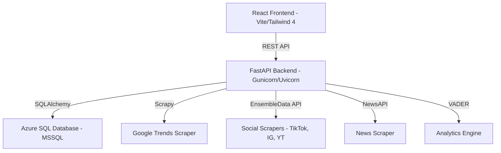

# Trends Research

A professional, full-stack intelligence platform for discovering, tracking, and analyzing emerging trends across multiple data sources. The system scrapes data from Google Trends, YouTube, Reddit, Hacker News, TikTok, Instagram, Threads, and NewsAPI, then processes it through an advanced analytics engine that calculates virality scores, clusters topics into niches, and surfaces actionable insights through a modern React dashboard.

---

## 🏗️ Architecture



### Key Components

| Component | Location | Description |
|-----------|----------|-------------|
| **React Frontend** | `frontend/` | Built with **React 19**, **Vite**, **Tailwind CSS 4**, and **shadcn/ui**. |
| **FastAPI Backend** | `src/api/` | REST API with 30+ endpoints, serving as the orchestration layer. |
| **Scrapers** | `src/scrapers/` | Custom Scrapy spiders + EnsembleData & NewsAPI clients. |
| **Analytics Engine** | `src/analytics/` | Custom virality scoring and VADER-based sentiment analysis. |
| **Niche Discovery** | `src/niche/` | Topic clustering using Union-Find algorithm and keyword overlap. |
| **Database** | `src/db/` | SQLAlchemy models with robust migration and diagnostic tools. |
| **Infrastructure** | `terraform/` | Fully automated Azure deployment (App Service, SQL, Key Vault). |

---

## 🚀 Quick Start

### Prerequisites

- **Python 3.11+**
- **Node.js 22+** with `pnpm`
- **ODBC Driver 18** for SQL Server
- **Azure Subscription** (optional, for cloud deployment)

### 1. Clone and Configure

```bash
git clone https://github.com/GlobalBrother/trends_research.git
cd trends_research
cp .env.example .env
# Edit .env with your database credentials and API keys
```

### 2. Install Python Dependencies

```bash
pip install -r requirements.txt
```

### 3. Install and Build the Frontend

```bash
cd frontend
pnpm install
pnpm build
cd ..
```

### 4. Database Setup & Migration

The project uses an idempotent migration system that handles both schema creation and indexing:

```bash
# Initial setup and schema creation
python -m src.db.setup_azure

# Run migration to sync indexes and new columns
python -m src.db.migrate
```

### 5. Start the Application

#### Development Mode (Hot Reload)
- **Terminal 1 (API):** `python src/api/main.py`
- **Terminal 2 (Frontend):** `cd frontend && pnpm dev`

#### Production Mode
The API is configured to serve the built frontend SPA automatically:
```bash
gunicorn src.api.main:app -k uvicorn.workers.UvicornWorker --bind 0.0.0.0:8000
```

---

## 🔐 Authentication & Security

- **OTP-based Login:** Uses Azure Communication Services (ACS) or Resend to send One-Time Passwords.
- **Role-Based Access Control (RBAC):** Two roles: `trends` (viewer) and `admin` (management/settings).
- **JWT-less Session Management:** Secure tokens stored in the database with configurable expiration.
- **Azure Key Vault:** Seamless integration for managing secrets in production environments.

---

## 📊 Analytics Engine

The system uses an advanced, multi-factor virality scoring algorithm:
$$Virality = \text{Freshness} \times (1 + 99 \times \text{sigmoid}(\text{LogVolume} + 2 \times \text{Growth} + \text{Engagement} + (\text{Diversity} + \text{Synergy}) + \text{Platform} + \text{Momentum} + \text{Surprise} + \text{Sentiment} + \text{Spread}))$$

### Core Scoring Factors

- **⏳ Freshness (Time Decay):** Exponential decay factor ($0.5^{age/24}$) that penalizes older trends, ensuring the dashboard surfaces what's breaking *now*.
- **🤝 Cross-Platform Synergy:** A multiplier bonus for trends that resonate across different platform types (e.g., a trend appearing on both TikTok and HackerNews).
- **📈 Momentum (Acceleration):** Measures the rate of change in growth. A trend with increasing speed is prioritized over one with steady high volume.
- **😲 Surprise Factor (Z-Score):** Highlights statistical outliers by comparing current volume to the historical/batch mean, surfacing "under-the-radar" breakouts.
- **🤖 Sentiment Analysis:** Integrated VADER sentiment scoring. Strong sentiment (positive or negative) boosts the virality score.
- **🌐 Geographic Spread:** Bonus points for trends surfacing in multiple regions.
- **🧩 Topic Clustering:** Union-Find algorithm groups similar topics across different platforms into a single "Aggregated Topic" to reduce noise and calculate true cross-platform impact.

---

## ☁️ Infrastructure & Deployment

### Terraform (Azure)
The `terraform/` directory contains everything needed to provision the stack on Azure:
- **Azure SQL:** Serverless database with auto-pause.
- **Azure Container Registry (ACR):** Private registry for Docker images.
- **App Service (Linux):** Web App for Containers hosting the API + Frontend.
- **Key Vault:** Centralized secret management.
- **Managed Identity:** Passwordless authentication between services.

### Docker
```bash
# Build and run with Docker Compose
docker compose up --build
```

---

## 🛤️ Future Roadmap & Next Steps

Based on the current project state, here are the proposed next steps:

1.  **🤖 LLM-Powered Insights:**
    - Integrate GPT-4/Claude to summarize trend clusters.
    - Generate "Market Opportunities" automatically from virality scores and sentiment.
2.  **📈 Advanced Scrapers:**
    - Add Pinterest, Lemon8, and X (Twitter) as data sources.
    - Deep-scrape comments to perform fine-grained audience sentiment analysis.
3.  **🔔 Real-time Notifications:**
    - Implement Webhooks and Slack/Discord integrations for instant alerts on viral trends.
4.  **🤝 Collaborative Research:**
    - Enable shared workspaces for teams to tag, comment, and collaborate on specific trends.
5.  **📑 Professional Exporting:**
    - Generate automated PDF/PowerPoint reports for stakeholders.
6.  **⚡ Task Queue Scalability:**
    - Migrate to Celery/Redis for managing large-scale, distributed scraping jobs.

---

## 🛠️ Maintenance & Diagnostics

Check your database connectivity and Azure configuration:
```bash
python -m src.db.doctor
```

---

## 📜 License

Private repository — © 2026 Global Brother SRL. All rights reserved.
